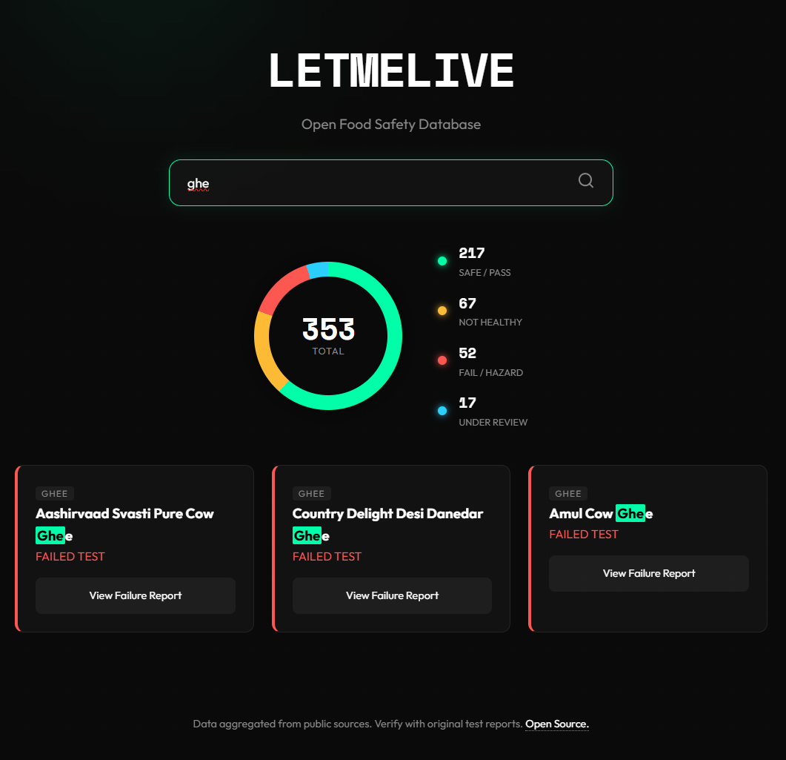

# LetMeLive (Open Food Safety India)




**An open-source aggregator for food safety test results in India.**

> **⚠️ DISCLAIMER: READ BEFORE USING**
>
> 1.  **We Are Not a Lab:** This project does **not** conduct independent lab testing. We only aggregate publicly available test reports from NABL-accredited labs, consumer organizations, and regulatory bodies.
> 2.  **No Liability:** The maintainers of this repository are not liable for the accuracy of the third-party reports, nor for any changes in product formulation or batch quality.
> 3.  **Verify the Source:** Every entry in our database includes a direct link to the original report. Users should always verify the latest status with the original source before making consumption decisions.
> 4.  **Batch Specificity:** Food safety results are often batch-specific. A "Fail" for one batch does not necessarily imply the entire brand is unsafe forever.

---

## 🎯 The Mission
Finding safe food in India is hard. Lab reports are scattered across PDFs, YouTube videos, and paywalled magazines.
**LetMeLive** centralizes this data into a simple, open-source JSON database that anyone can query, audit, or build apps upon.

## 📂 Data Sources
We aggregate **factual data** (Brand Name, Pass/Fail Status, Batch Number) from the following public sources:
* **Trustified** (Supplements & Health Foods)
* **Unbox Health** (Packaged Foods)
* **The Liver Doc** (Herbal & Ayurvedic Safety)

## 🤝 How to Contribute

We believe in **Open Data**. If you have found a verified lab report that isn't listed, you can contribute directly by adding it to `open_data.json`.

### Contribution Schema
Please follow this JSON structure when adding new products:

```json
{
  "category_name": {
    "pass": [
      {
        "name": "Brand Name - Product Name",
        "link": "https://link-to-public-lab-report.com",
        "source": "Lab Name / Organization"
      }
    ],
    "fail": [{
        "name": "Brand Name - Product Name",
        "link": "https://link-to-public-lab-report.com",
        "source": "Lab Name / Organization"
      }],
    "not_healthy": []
  }
}
```

### Rules for Contribution
1.  **Source Required:** You must include a direct link to the lab report or study. entries without links will be rejected.
2.  **No Hearsay:** Do not add data based on "news articles" or "influencer opinions" unless they contain a downloadable lab PDF.
3.  **Neutral Naming:** proper casing for Brand and Product names.
4.  **Categories:** Use existing categories (e.g., `protein`, `supplements`, `packaged`) where possible.